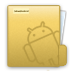

 Android File Explorer
=====================

I started writing Android File Explorer back in October 2011.
The designs goals behind this app were (and are)
- Usability
- Close adherence with Android UI Design guidelines
- Speed 

However, admittedly, I haven't pushed any update since April 2012. The project has been dormant all this while but its far from dead.

In the past one year, a lot of awesome frameworks and design patterns have emerged.
I will be making use of many of these frameworks, tools and design patterns with a complete rewrite of the app.   
Plan is to also start a donate version.

PS: You can download this app from [Google Play](https://play.google.com/store/apps/details?id=net.appositedesigns.fileexplorer "Android File Explorer on Google Play") 